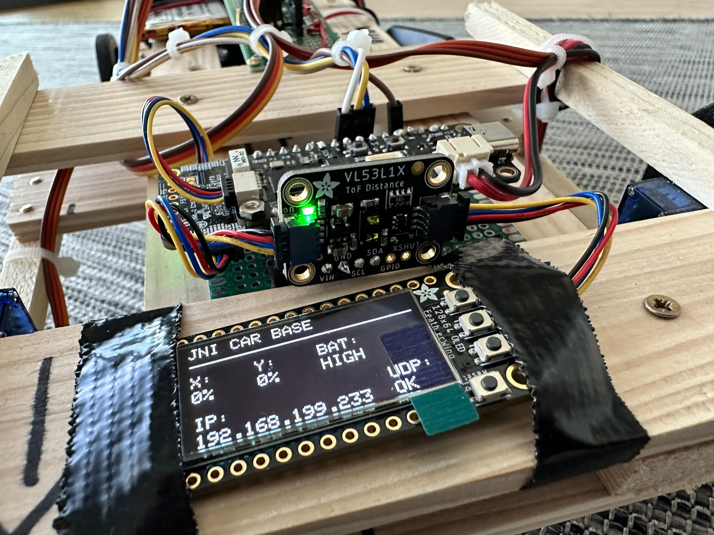
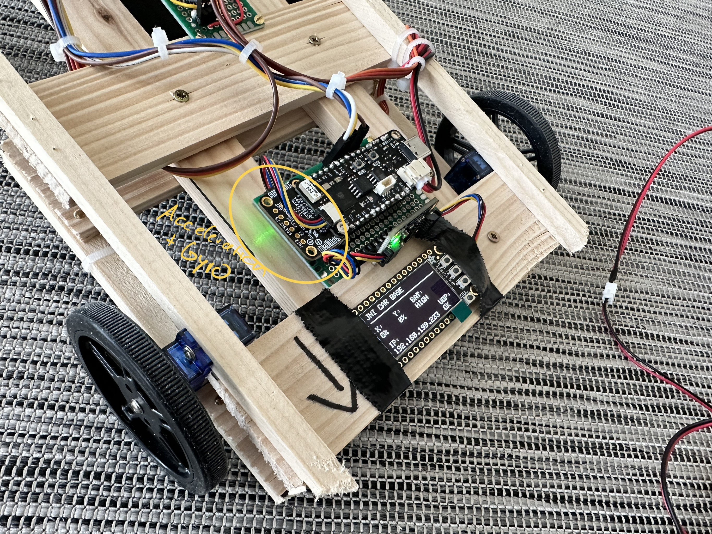
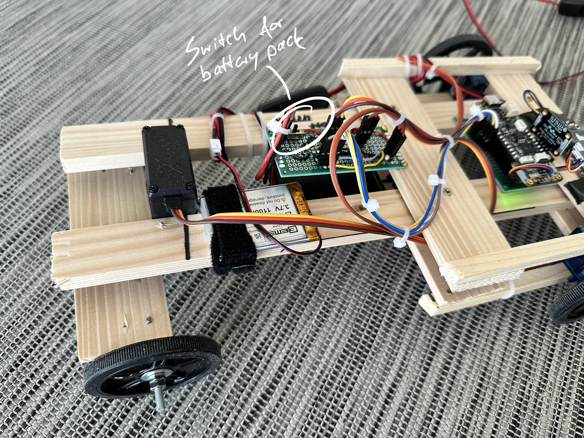
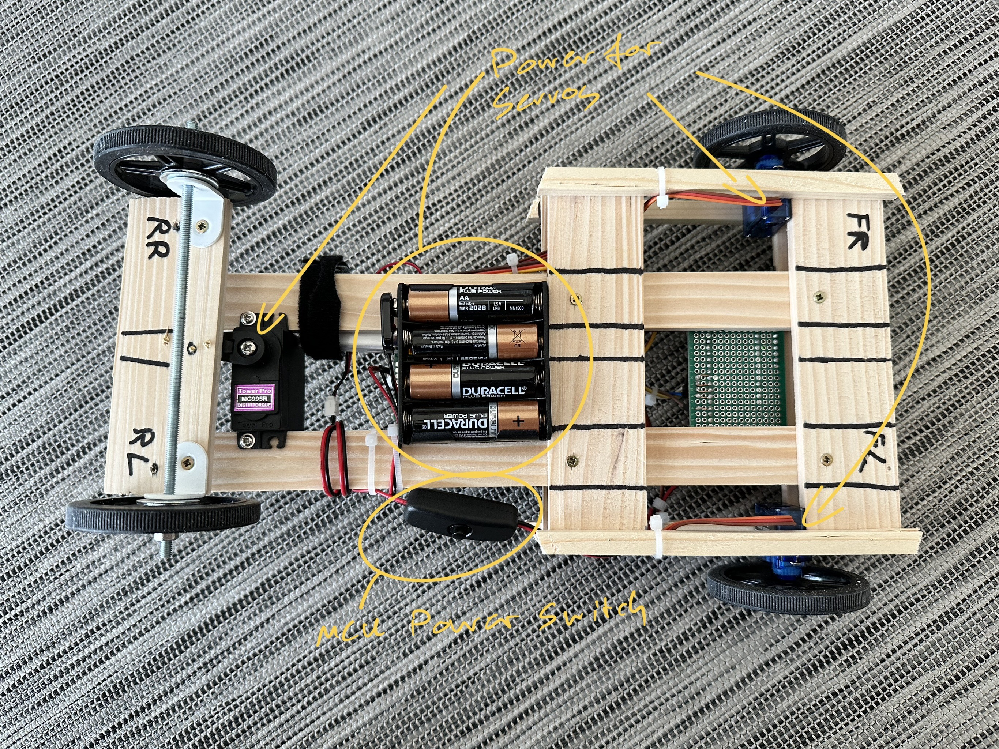
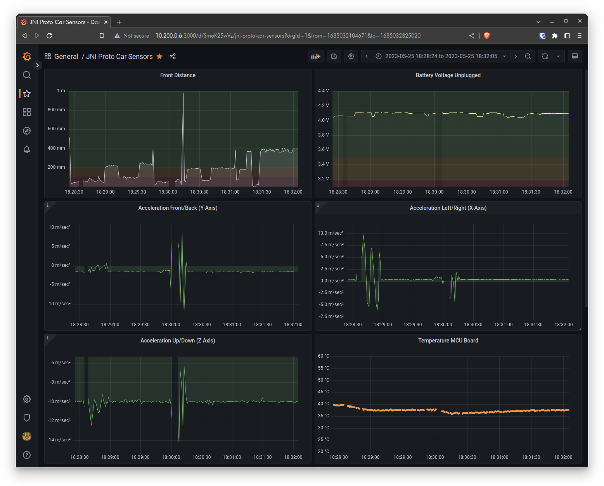

JNI Proto Car Base
==================
This is the firmware project to control the base microcontroller of the JNI Proto Car.
This project rewrites the original CircuitPython code to C++ and uses the Arduino framework.


A project for to control JNI Proto Car with a PS3 controller can be found 
[here](https://github.com/mopore/jni-proto-car-control).


# Features
## Chassis and Motors
* Two driving (seperated) continious servo motors on front axis (FS90R). 
* One servo motor for steering the rear axis (MG995R).
* Wooden chassis with custom soldered PCBs for motor control and MCU breakout.
* 4x1.5V AA batteries pack for motor power with switch on PCB.
* 1x3.7V 1100mAh battery for MCU power with separate switch.

## Sensors and Connectivity
* Unexpected Maker Feather S3 Microcontroller (ESP32-S3) (https://unexpectedmaker.com/shop/feathers3)
* Distance sensor (VL53L4CX) for obstacle detection on the front.
* Accelerometer and Gyro sensor (ICM20649) for acceleration and tilt detection reading at 10Hz.
* OLED 128x64 display for debugging and status information.
* Direct Steering via UDP socker over Wifi at 100Hz
* MQTT connectivity (Currently only Alive tick w/ IP address)

### MQTT Data and Topics
Alive tick on topic `jniHome/services/jniProtoCar/alive` with IP address as payload every 5 seconds.

Sensor data on topic `jniHome/objects/jniProtoCar/events/sensors` publishing at 1Hz.
Example output:
```json
		{
		"temperatureCelsius": 32.69317245,
		"accelX": 0.239420176,
		"accelY": -1.541865945,
		"accelZ": -9.959878922,
		"gyroX": 0.014899152,
		"gyroY": 0.00212845,
		"gyroZ": 0,
		"frontDistance": 765,
		"batVoltUnplug": 4.2
		}
```


## Impressions
### Overview


### Display and Sensors


### Front


### Back


### Underside


### Sensor Data Visualitzation


# Pre-requisites
* Fully setup platformIO environment
* An ESP32-S3 Microcontroller
* A Wifi network
* An MQTT broker (e.g. mosquitto)
* A ready-to-go JNI Proto car control unit (including connected PS3 contoller)


# Setup
## Create a include/jni_config.h file
For Wifi and further network setup. Create a file called `include/jni_config.h` with the following content:

```c
#define SHOW_ENGINE_CONTROL_DEBUG 0

#define WIFI_SSID      "your-wifi-ssid"
#define WIFI_PASS      "your-wifi-password"

#define UDP_RECEIVER_SOCKET_PORT 8080

#define JNI_MQTT_BROKER_IP "192.168.100.219"
#define JNI_MQTT_BROKER_PORT 1883
```

# Usage
* Turn on the MCU power switch and battery pack.
* Wait for the Wifi connection (OLED shows IP address).
* Check for an Alive message (every 5 seconds) on MQTT broker on topic `jniHome/services/jniProtoCar/alive`.
* Turn on the controller unit and hit the PS button to connect to control unit.
* Once the Bluetooth connection is established the UDP connection state between control unit and base changes to 'OK' (operational).